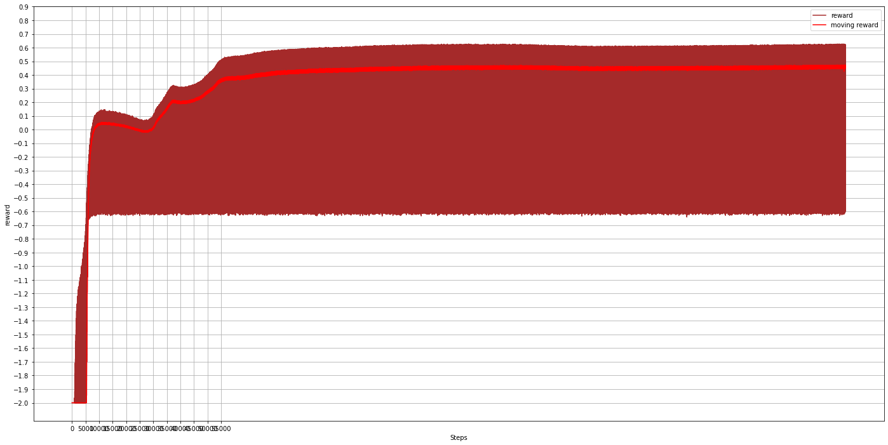
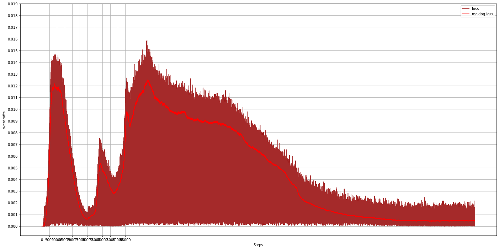
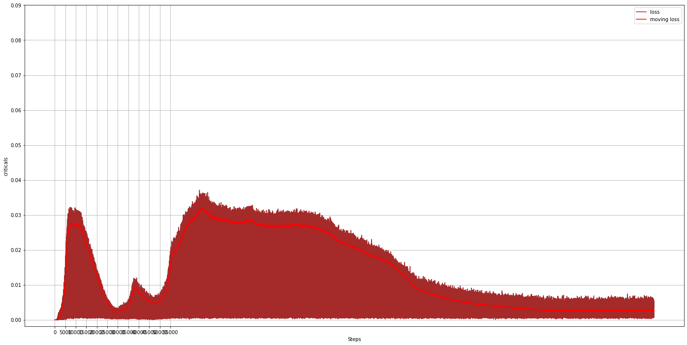
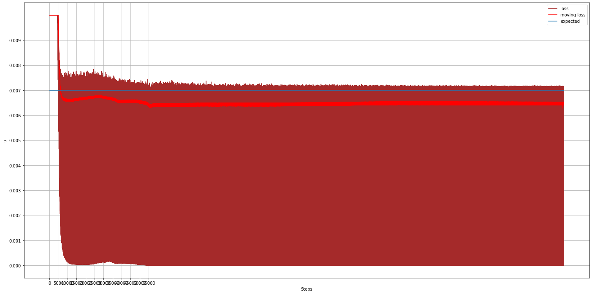
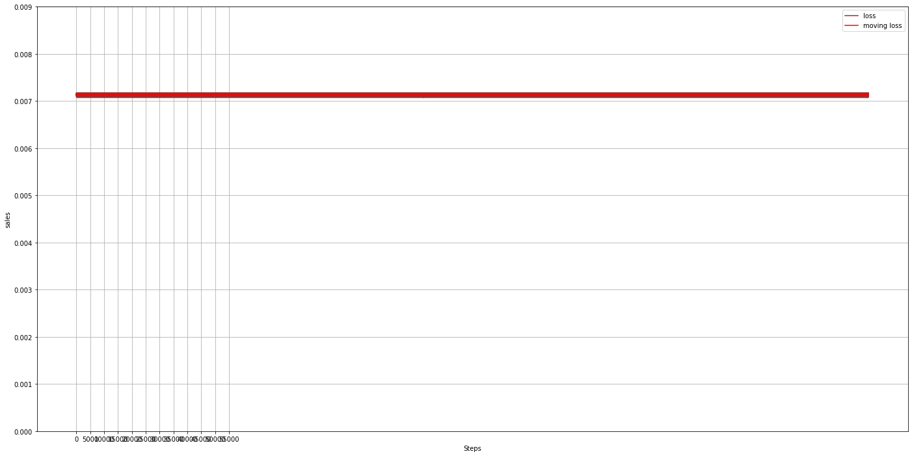
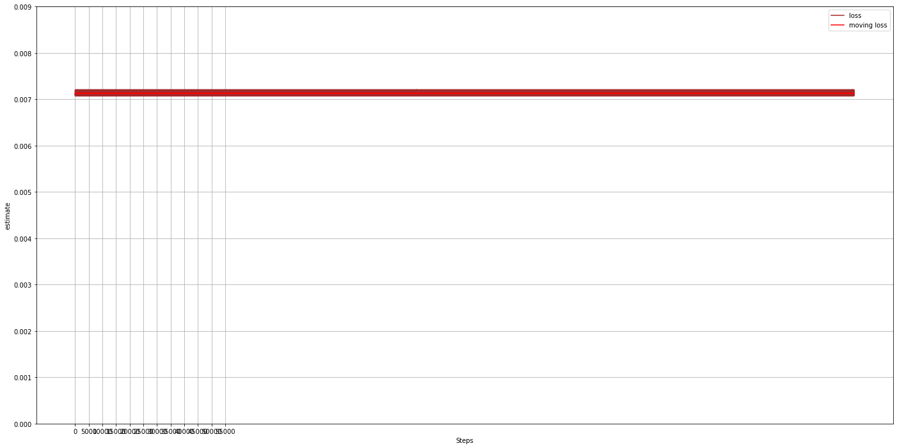
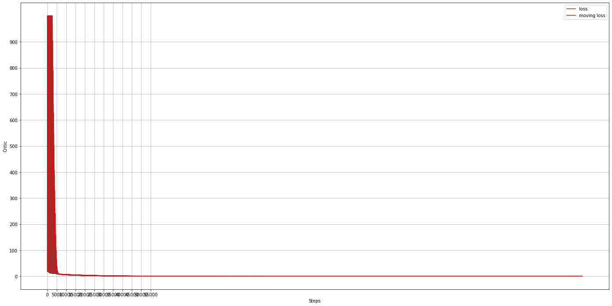
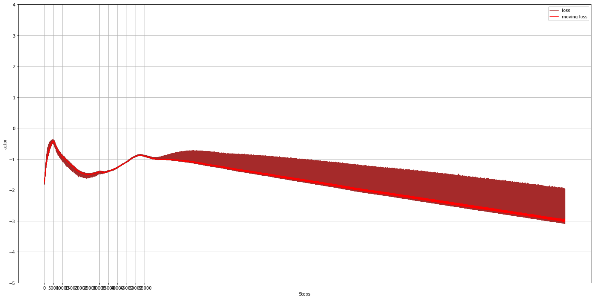

# banking_solution
Help customers to estimate future debits/credits on account and advise funds transfer to avoid overdraft

There are two models here:

1. Forecasting to estimate next period spending and incomes
2. Estimate account deposit to avoid account overdraft

Forecasting
-----------

Model uses transformer-decoder architecture. Last output item is a prediction of the next interval value (next week or next day). 

Training steps:

1. Prepare data

Data that is used here is from fraud-detection-handbook. Please download and generate data. Something like two years (730 days) should be used because data is generated for forecasting and for second task - estimating deposit to avoid overdrafts. This second models need more time steps. One year is just about 52 weeks, so two years seems more reasonable. When generating data in fraud-detection-handbook, fraud shoud be disabled.

Command below will create train and test files for both forecasting and estimating deposit to avoid overdrafts plus file sutable for autoregression:

python prepare_data.py --lookback_history=12 --scaler=Custom --aggregate=WEEK --train_file4=data/simulated_without_fraud_730.txt

2. Training

Loss is RMSE.

Command:

python training.py --action=TRAIN --output_dir=checkpoints --hidden_size=32 --train_epochs=300 --save_batches=1000 --training_set_size=422746 --batch_size=32 --lookback_history=12 --dropout_prob=0.1 --num_features=1 --learning_rate=1e-4 --scaler=Custom --num_hidden_layers=2 --num_attention_heads=2

3. Evaluate

It will create output.csv file with metrics.

python training.py --action=EVALUATE --output_dir=checkpoints --hidden_size=32 --batch_size=32 --lookback_history=12 --num_features=1 --scaler=Custom --num_hidden_layers=2 --num_attention_heads=2

4. Predict

It will create output.csv file with predictions: actual/estimate pairs.

python training.py --action=PREDICT --output_dir=checkpoints --hidden_size=32 --batch_size=32 --lookback_history=12 --num_features=1 --scaler=Custom --num_hidden_layers=2 --num_attention_heads=2 --predict_file=test.tfrecords

Estimation of deposit
---------------------

This model is based on code of inventory management. It is a similar problem. If there is an outflow of funds then what the amount should be brought in? This is Markov decision process (MDP) implemented with deep RL, TD(0) synchronous A2C algorithm. PPO is also there though it does not perform well. Please review also inventory_management, it has references to papers explaining what it is based on and how it is implemented.

Training steps:

1. Prepare data

Estimates are done in the forecasting part. It is just packaged differenly for this problem, records is a time sequence, each record has estimated and actual value structured as (accounts, estimated_value(s)). For example, (4997, 1). 1 is for debit in this case. if creadit is predicted as well, it will be 2.

Both for training and prediction, customer balances are random. Obviously, for prediction, it would be needed to provide actual account balances.  

prepare_data.py had already generated history when data for forecasting has been prepared.

- balance_train.tfrecords
- balance_test.tfrecords

Model does not estimate on the fly, estimates are prepared from history. From transformer-decoder folder, run these commands to create estimates files:  

time python training.py --action=PREDICT_FOR_BALANCE --output_dir=checkpoints --hidden_size=32 --lookback_history=12 --num_features=1 --scaler=Custom --num_hidden_layers=2 --num_attention_heads=2 --predict_file=balance_train.tfrecords --output_file=balance_train_estimate.tfrecords --num_accounts=4997
time python training.py --action=PREDICT_FOR_BALANCE --output_dir=checkpoints --hidden_size=32 --lookback_history=12 --num_features=1 --scaler=Custom --num_hidden_layers=2 --num_attention_heads=2 --predict_file=balance_test.tfrecords --output_file=balance_test_estimate.tfrecords --num_accounts=4997

2. Rewards formula:

r(s) = 1 - k1*z - k2*critical - k3*balance

z - 1 if overdraft
critical - 1 if breached some critical level

k1 - tuning coefficient for overdraft
k2 - tuning coefficient for critical balance
k3 - tuning coefficient for balance panishment
 
3. Training

When training, see critic and actor and reward convergence. Also, at the end, account funding transfers averages should be close to the average spending: 2k ~ 2k. for example. Otherwise, there balance will get into zero and there will be overdrafts or balance will get to maximum and there will be a lot of money in the account.

Command sample:

python training.py --action=TRAIN --train_episodes=6000 --output_dir=checkpoints --algorithm=A2C --num_accounts=4997 --train_file=balance_train_estimate.tfrecords --batch_size=2 --waste=32.0 --hidden_size=256 --entropy_coefficient=0.0001 --actor_learning_rate=1e-4 --critic_learning_rate=1e-4 --use_actual --zero_weight=0.2 --critical_weight=0.1 --critical_balance=0.02

Rewards 

Waste

Overdraft

Critical balance

Balance

Action gaussian mean value

Action Sample from distribution

Spendings Actual

Spendings Estimate

Critic loss

Actor loss

Entropy

4. Evaluation

Training produces plenty of metrics:

- rewards
- waste
- overdraft
- critical balance
- balance
- action (transfer)
- spending
- critic loss
- actor loss
- entropy

5. Prediction

It produces 

as trained model:
- balance
- action
- overdraft

Model in action!

as heuristic algorithm:
- balance
- action
- overdraft

Heuristic 

and

- debit estimate
- actual debit

Sample command:

python training.py --action=PREDICT --train_episodes=6000 --output_dir=checkpoints --algorithm=A2C --num_accounts=4997 --train_file=data/balance_train_estimate.tfrecords --batch_size=2 --waste=32.0 --hidden_size=256 --entropy_coefficient=0.0001 --actor_learning_rate=1e-4 --critic_learning_rate=1e-4 --use_actual --zero_weight=0.2 --critical_weight=0.1 --critical_balance=0.02 --predict_file=data/balance_test_estimate.tfrecords

This will produce output.csv with iabove metrics for each timestep. if taking one account and following it over time, metrics will look like this
